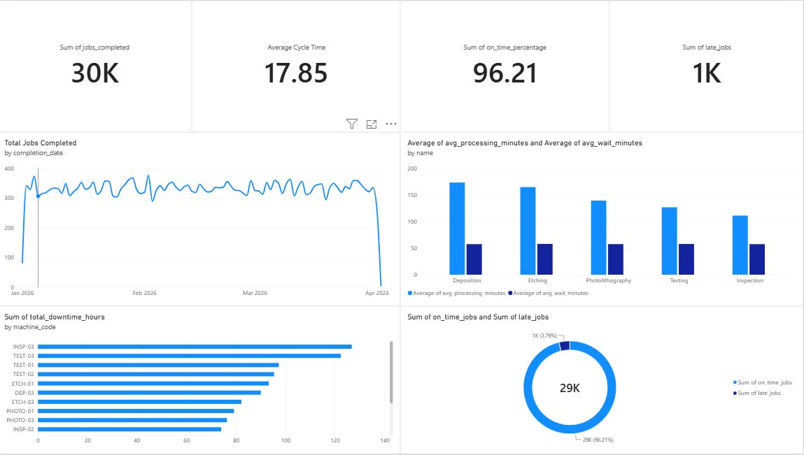

# Manufacturing Analytics & Scheduling System

A synthetic, semiconductor-inspired manufacturing analytics system built to
explore production performance, database analytics, ETL automation,
discrete-event simulation, scheduling policies, and operational root-cause
analysis.

The project models **30,000 production jobs**, **150,000 job-operation records**,
**5 sequential work centers**, and **15 machines** across a synthetic 90-day
manufacturing period. It is an engineering portfolio project, not a model of a
specific semiconductor factory.

## Tech Stack

- Python, Pandas, and NumPy
- PostgreSQL, SQL, SQLAlchemy, and psycopg
- Power BI
- SimPy
- Git and GitHub

## System Workflow

```text
Synthetic Manufacturing Data
            ↓
      Validation / ETL
            ↓
        PostgreSQL
            ↓
    SQL Analytics Views
            ↓
    Power BI Dashboard
            ↓
   Root-Cause Analysis
```

The same synthetic workload concepts are used separately in SimPy
discrete-event simulation experiments to compare production capacity and job
scheduling policies.

## Power BI Dashboard



The dashboard presents completed jobs, average cycle time, on-time performance,
late jobs, daily throughput, work-center processing and wait times, machine
downtime, and the distribution of On-Time versus Late jobs.

## Key Results

- Analyzed **30,000 jobs** and **150,000 operations**.
- Observed **96.21% on-time delivery**, with **1,137 late jobs** in the generated
  dataset.
- Measured a baseline simulation average cycle time of **315.53 minutes**.
- Increasing Photolithography capacity from 3 to 4 machines reduced average
  cycle time to **234.68 minutes**, a **25.62% reduction**, and shifted the
  bottleneck to Deposition.
- SPT produced the lowest overall cycle time among the tested scheduling
  policies at **289.93 minutes**, approximately **6% lower than FIFO**.
- Priority scheduling reduced High-priority average cycle time to **180.06
  minutes**, while increasing Standard-job cycle time, demonstrating the tradeoff
  between urgency and overall efficiency.
- Root-cause analysis identified a strong workload/deadline mismatch for large
  synthetic batches.

## Root-Cause Analysis

Product type was not a strong differentiator: late rates ranged only from 3.63%
to 4.06%. Late jobs had somewhat higher average waiting time than On-Time jobs
(67.62 versus 57.09 minutes per operation), but processing time showed a much
larger difference (233.79 versus 139.19 minutes per operation). Late jobs also
had a larger average quantity: 446.52 units versus 266.88 units.

| Quantity range | Avg. processing per operation | Late rate |
| --- | ---: | ---: |
| 1-100 | 39.03 minutes | 0.00% |
| 101-200 | 78.13 minutes | 0.00% |
| 201-300 | 130.57 minutes | 0.00% |
| 301-400 | 182.94 minutes | 2.00% |
| 401-500 | 234.94 minutes | 15.36% |

Processing time increased strongly with batch quantity, while deadline allowance
remained approximately 72 hours across all quantity ranges. **1,004 of the 1,137
late jobs** occurred in the 401-500 range. This identifies a design characteristic
of the synthetic dataset—a mismatch between workload and deadline allowance—and
does not establish real-world semiconductor manufacturing causation. No
corrective action has been tested.

The supporting investigation is available in
[root_cause_analysis.sql](analysis/root_cause_analysis.sql), with detailed
interpretation in [root_cause_findings.md](analysis/root_cause_findings.md).

## Simulation Experiments

The initial SimPy experiment modeled 100 jobs moving through all five work
centers.

| Scenario | Jobs completed | Average cycle time | Key average waits |
| --- | ---: | ---: | --- |
| Baseline (3 machines per work center) | 100 | 315.53 minutes | Photolithography: 145.53 minutes; other work centers: approximately 0 minutes |
| Photolithography capacity increase (4 machines; all others unchanged) | 100 | 234.68 minutes | Photolithography: 0 minutes; Deposition: 64.68 minutes |

Increasing capacity at the original Photolithography bottleneck reduced average
cycle time by **25.62%**, but shifted the bottleneck downstream to Deposition.

## Scheduling Comparison

FIFO, Shortest Processing Time (SPT), and Priority scheduling were compared with
the same seeded 100-job workload and three machines per work center.

| Scheduling policy | Jobs completed | Average cycle time | High-priority cycle time | Standard cycle time |
| --- | ---: | ---: | ---: | ---: |
| FIFO | 100 | 308.47 minutes | 276.09 minutes | 312.88 minutes |
| SPT | 100 | 289.93 minutes | 311.70 minutes | 286.96 minutes |
| Priority | 100 | 309.95 minutes | 180.06 minutes | 327.67 minutes |

SPT produced the lowest overall average cycle time, improving it by approximately
**6%** compared with FIFO. Priority scheduling dramatically reduced cycle time
for High-priority jobs but increased it for Standard jobs, illustrating the
tradeoff between optimizing overall performance and prioritizing urgent work.

## Automated ETL Pipeline

Run the complete synthetic-data workflow with:

```bash
python scripts/run_pipeline.py
```

The command generates jobs, job operations, and downtime events; validates the
datasets; loads them into PostgreSQL; and verifies database counts and
references. The tested workflow rebuilt:

- 30,000 jobs
- 150,000 job operations
- 220 downtime events
- 3 products
- 15 machines
- 0 orphan job-operation references

This is a reproducible automated ETL workflow for the project, not an enterprise
production pipeline.

## Project Structure

```text
analysis/       SQL investigation and documented root-cause findings
data/           Generated synthetic CSV datasets
database/       Reusable PostgreSQL analytics views
powerbi/        Power BI dashboard, PBIX file, and dashboard image
scripts/        Data generation, validation, loading, and pipeline orchestration
simulation/     SimPy capacity and scheduling experiments
tests/          Project test location
README.md       Project overview and results
requirements.txt
```

## Running the Project

1. Create and activate a Python virtual environment:

   ```bash
   python -m venv .venv
   ```

   On Windows PowerShell:

   ```powershell
   .\.venv\Scripts\Activate.ps1
   ```

2. Install the project dependencies:

   ```bash
   python -m pip install -r requirements.txt
   ```

3. Configure the existing local PostgreSQL database connection in `.env`:

   ```text
   DB_HOST=...
   DB_PORT=...
   DB_NAME=...
   DB_USER=...
   DB_PASSWORD=...
   ```

4. Run the automated workflow:

   ```bash
   python scripts/run_pipeline.py
   ```

5. Open `powerbi/manufacturing_performance_dashboard.pbix` manually in Power BI
   Desktop to inspect the dashboard.

The pipeline expects the project's PostgreSQL tables and reference data to
already exist; it does not create or replace the schema.

## Limitations

- All manufacturing data is synthetic.
- The system is semiconductor-inspired but does not represent a specific real
  factory.
- Simulation outcomes depend on simplified processing, arrival, capacity, and
  scheduling assumptions.
- Analytical findings and experiment results should be interpreted as project
  evidence, not real manufacturing performance claims.
